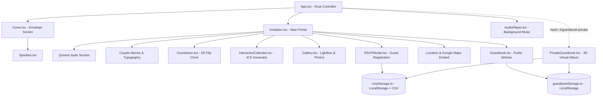

<div align="center">

# 💍 Ahmed & Basmala — Royal Digital Marriage Invitation
### 🌹 *Velvet Crimson & Cream Heritage Edition*

**A bespoke, high-performance, interactive digital marriage portal engineered with React 19, TypeScript, Tailwind CSS v4, and Motion.**

<br />

[](https://Bavly-Hamdy.github.io/Engagment-V2/)
[](https://react.dev/)
[](https://www.typescriptlang.org/)
[](https://tailwindcss.com/)
[](https://motion.dev/)
[](https://vitejs.dev/)
[](https://opensource.org/licenses/MIT)

<br />


<p align="center">
  <a href="#-features-at-a-glance"><b>Explore Features</b></a> •
  <a href="#-visual-showcase--gallery"><b>Visual Showcase</b></a> •
  <a href="#-design-system--tokens"><b>Design System</b></a> •
  <a href="#-quick-start--installation"><b>Quick Start</b></a> •
  <a href="#-private-3d-guestbook"><b>3D Guestbook</b></a> •
  <a href="#-deployment"><b>Deploy</b></a>
</p>

</div>

---

## 📑 Table of Contents

- [✨ Executive Overview](#-executive-overview)
- [📸 Visual Showcase & Media Assets](#-visual-showcase--media-assets)
- [🌟 Complete Feature Breakdown](#-complete-feature-breakdown)
  - [1. Cinematic Envelope Cover & Sparkle Engine](#1-cinematic-envelope-cover--sparkle-engine)
  - [2. Synchronized 3D Flip Countdown Timer](#2-synchronized-3d-flip-countdown-timer)
  - [3. Interactive Calendar with 1-Click `.ics` Export](#3-interactive-calendar-with-1-click-ics-export)
  - [4. Heirloom Photo Gallery & Spring Lightbox](#4-heirloom-photo-gallery--spring-lightbox)
  - [5. Geolocation, Map Embed & 1-Tap GPS Routing](#5-geolocation-map-embed--1-tap-gps-routing)
  - [6. Real-Time RSVP Engine with Multi-Guest Tracking](#6-real-time-rsvp-engine-with-multi-guest-tracking)
  - [7. Confidential 3D Turn-Page Guestbook (`#/guestbook-private`)](#7-confidential-3d-turn-page-guestbook-guestbook-private)
  - [8. Ambient Soundtrack & Floating Audio Controller](#8-ambient-soundtrack--floating-audio-controller)
  - [9. UTF-8 BOM CSV Export for Excel](#9-utf-8-bom-csv-export-for-excel)
- [🎨 Design System & Color Tokens](#-design-system--color-tokens)
- [🏗️ Architecture & Component Anatomy](#️-architecture--component-anatomy)
- [📂 Directory Tree](#-directory-tree)
- [🚀 Quick Start & Installation](#-quick-start--installation)
- [⚙️ Customization Guide](#️-customization-guide)
- [🌐 Production Deployment Guide](#-production-deployment-guide)
- [📱 Mobile & Performance Benchmarks](#-mobile--performance-benchmarks)
- [🤝 Contributing & License](#-contributing--license)

---

## ✨ Executive Overview

**Ahmed & Basmala's Digital Marriage Invitation** is not simply a static landing page — it is an immersive, multi-sensory wedding portal engineered to bridge sacred Egyptian familial heritage with the bleeding edge of modern web architecture.

When planning their ceremony for **Friday, October 30, 2026**, the couple desired an invitation that eliminated the disposable nature of physical stationery while amplifying warmth and personalization. This project answers that challenge by delivering:

- **Velvet Floral Visual Identity**: Centered around deep royal crimson florals (`#991b2e`), antique gold filigree, and textured ivory damask.
- **Audio-Visual Atmosphere**: Automatically synchronized background orchestrations (*الليل وسماه*) accompanying tactile micro-interactions.
- **Zero-Friction Guest Experience**: Intuitive RSVP tracking, instant calendar syncing, and single-click GPS mapping straight to the family residence in *El Qanater El Khayreya*.
- **Private Couple Administration**: A secret, client-side 3D animated guestbook allowing the bride and groom to flip through incoming blessings like a genuine physical leather album.

---

## 📸 Visual Showcase & Media Assets

<div align="center">

### 🌹 Signature Visual Identity
*All media assets are optimized, vectorized, and compressed for instant loading across global 4G/5G mobile connections.*

<table>
  <tr>
    <td width="50%" align="center">
      <b>🌹 The Velvet Crimson Card Frame</b><br/><br/>
      
      <br/><br/>
      <sub>Handcrafted velvet roses with tassel ornaments and embossed floral relief lace</sub>
    </td>
    <td width="50%" align="center">
      <b>💑 The Couple • Ahmed & Basmala</b><br/><br/>
      
      <br/><br/>
      <sub>"عقد قراننا" — High-resolution studio vector illustration with transparent background</sub>
    </td>
  </tr>
  <tr>
    <td colspan="2" align="center">
      <b>👶 Childhood Memories • "بداية الحكاية"</b><br/><br/>
      
      <br/><br/>
      <sub><em>"ذكريات طفولة بريئة كانت أول سطور في أجمل قصة حب"</em> — Archived childhood memory portrait</sub>
    </td>
  </tr>
</table>

</div>

---

## 🌟 Complete Feature Breakdown

### 1. Cinematic Envelope Cover & Sparkle Engine
The application opens with a full-viewport envelope cover that locks document scrolling until the guest intentionally interacts:
- **Motion Variants (`motion/react`)**: Uses custom spring dampers (`ease: [0.16, 1, 0.3, 1]`) for smooth entrance.
- **Sparkle Particle Generator**: Dynamically spawns animated 4-point SVG sparkles across the canvas with randomized scales, delays, and coordinates.
- **Envelope Dismissal**: Upon clicking **"افتح الدعوة" (Open Invitation)**, the cover gracefully slides upward (`y: -100%`) with an ease-in-out transition while initiating the ambient audio track.

```tsx
// Staggered motion container orchestrating entrance
const containerVariants = {
  hidden: { opacity: 0 },
  visible: {
    opacity: 1,
    transition: { staggerChildren: 0.18, delayChildren: 0.25 },
  },
};
```

---

### 2. Synchronized 3D Flip Countdown Timer
A real-time ticker calculating the exact distance between the client's current timestamp and **October 30, 2026, 19:00:00 GMT+03:00**:
- **Flip Digit Component**: Employs CSS 3D perspective (`perspective: 400px`) and `AnimatePresence` to rotate incoming numbers along the X-axis from `-90deg` to `0deg`.
- **Glossy Skeuomorphic Shaders**: Each digit card features top-down gradient shine, hairline split dividers, and glassmorphic blur.
- **Bilingual Labels**: Simultaneous English and Arabic time units with tabular numerals (`tabular-nums`) to prevent horizontal layout shifting.

---

### 3. Interactive Calendar with 1-Click `.ics` Export
- **Dynamic Month Grid**: Generates accurate Gregorian calendar days for October 2026, calculating month offsets and day counts automatically.
- **Event Highlighting**: Day 30 is badged with an active ruby accent fill, double focus ring, and an animated pulsing heart indicator.
- **Native RFC 5545 iCalendar (`.ics`) Generator**: Generates an in-memory iCalendar file blob on the fly, allowing guests to import the event with reminders directly into **Apple Calendar, Google Calendar, or Microsoft Outlook**:

```typescript
function generateICSFile(): void {
  const icsContent = [
    "BEGIN:VCALENDAR",
    "VERSION:2.0",
    "PRODID:-//Ahmed & Basmala//Marriage//EN",
    "CALSCALE:GREGORIAN",
    "METHOD:PUBLISH",
    "BEGIN:VEVENT",
    "DTSTART:20261030T190000",
    "DTEND:20261030T233000",
    "SUMMARY:💍 عقد قران أحمد وبسملة",
    "DESCRIPTION:حفل عقد قران أحمد وبسملة - 31 شارع ابراهيم الدسوقي، عزبة الاهالي، القناطر الخيرية",
    "LOCATION:31 شارع ابراهيم الدسوقي، عزبة الاهالي، القناطر الخيرية",
    "STATUS:CONFIRMED",
    "END:VEVENT",
    "END:VCALENDAR"
  ].join("\r\n");
  // Instant trigger download via temporary anchor element
}
```

---

### 4. Heirloom Photo Gallery & Spring Lightbox
- **Archival Dual-Frame Design**: Features two centerpiece photo cards (*Childhood* and *Marriage Day*) adorned with gold-filigree borders and corner florets.
- **Interactive Love Reactions**: Real-time heart counters with persistent state so guests can express their love.
- **Spring-Loaded Lightbox Modal**: Clicking any portrait launches a high-fidelity modal with spring physics (`damping: 25`, `stiffness: 220`), backdrop blur (`backdrop-blur-md`), and expanded bilingual narrative captions.

---

### 5. Geolocation, Map Embed & 1-Tap GPS Routing
- **Address**: 31 Ibrahim El-Desouky St., Ezbet El-Ahaly, El Qanater El Khayreya (31 شارع ابراهيم الدسوقي، عزبة الأهالي، القناطر الخيرية).
- **Exact Coordinates**: `30°12'00.1"N 31°06'24.6"E` (`30.200039, 31.106838`).
- **Interactive Embed**: Google Maps iframe embedded with high-contrast styling and zero-margin responsive wrapper.
- **Deep-Linked GPS Navigation**: Dedicated button opening Google Maps App navigation directly to the door.

---

### 6. Real-Time RSVP Engine with Multi-Guest Tracking
- **Validation**: Enforces non-empty name sanitization before submission.
- **Party Size Selector**: Guests select their party headcount (1 to 10+ persons).
- **Instant Local Storage Sync**: Submissions are stored locally and broadcast via `window.dispatchEvent(new Event("storage"))` for zero-latency multi-tab updates.
- **Congratulatory Particle Burst**: Displays an animated success checkmark with celebratory sparkles upon confirmation.

---

### 7. Confidential 3D Turn-Page Guestbook (`#/guestbook-private`)
Accessed via secret URL hash (`#/guestbook-private`), this administrative portal provides the couple with an extraordinary keepsake:
- **Perspective 3D CSS Book**: True 3D perspective (`perspective: 1500px`) with multi-layered front cover, aged paper interior pages, page-curl shaders, and back cover.
- **Realistic Page Turns**: Direction-aware rotation transformations with realistic drop shadows and spine creases.
- **Keyboard Navigation**: Flip through wishes using arrow keys (`ArrowLeft`, `ArrowRight`, `Space`).
- **Quick-Copy Attendance Roster**: One-click button copies a formatted Arabic WhatsApp summary of all confirmed guests and total headcount directly to the clipboard.

---

### 8. Ambient Soundtrack & Floating Audio Controller
- **Track**: The legendary classic Egyptian romantic soundtrack *الليل وسماه*.
- **Continuous Loop**: Native HTML5 audio integration configured to loop smoothly.
- **Discreet Floating HUD**: Bottom-floating disc controller with rotating needle animations, play/pause toggles, and volume indicators.

---

### 9. UTF-8 BOM CSV Export for Excel
To facilitate wedding planning and banquet seating:
- Converts stored RSVP entries into structured CSV files.
- Prepends the **UTF-8 Byte Order Mark (`\uFEFF`)** to guarantee flawless rendering of Arabic names and prayers in Microsoft Excel without character corruption.

---

## 🎨 Design System & Color Tokens

This project adheres to a strict luxury design system configured via Tailwind CSS v4 `@theme` directives in [index.css](file:///c:/Users/Bavly%20Hamdy/Downloads/Compressed/Engagement-main/src/index.css):

```css
@theme {
  --color-brand-bg: #fffcf9;          /* Warm Pearl Ivory */
  --color-brand-primary: #2d1519;     /* Deep Wine Espresso */
  --color-brand-secondary: #784d56;   /* Refined Rosewood Mauve */
  --color-brand-accent: #991b2e;      /* Royal Velvet Crimson */
  --color-brand-border: #e8d2d6;      /* Soft Rose Gold Filigree */
  --color-brand-faint: #fbf2f4;       /* Delicate Blush Cream */

  --font-sans: "Inter", sans-serif;
  --font-serif: "Playfair Display", Georgia, serif;
  --font-arabic: "Amiri", serif;
  --font-calligraphy: "Aref Ruqaa", "Amiri", serif;
}
```

### Color Token Reference Table

| Token Variable | Hex Code | Visual Swatch | Semantic Purpose |
|---|---|:---:|---|
| `--color-brand-accent` | `#991b2e` |  | Primary action buttons, active calendar dates, sparkles, badges |
| `--color-brand-primary` | `#2d1519` |  | Main names, high-contrast headings, Quranic verse typography |
| `--color-brand-secondary` | `#784d56` |  | Subheadings, dates, captions, calendar weekdays |
| `--color-brand-border` | `#e8d2d6` |  | Card outlines, dividers, filigree frame borders |
| `--color-brand-faint` | `#fbf2f4` |  | Watermark background text, subtle button fills, inputs |
| `--color-brand-bg` | `#fffcf9` |  | Base canvas background ensuring eye comfort |

---

## 🏗️ Architecture & Component Anatomy



---

## 📂 Directory Tree

```text
Engagment-V2/
├── .gitignore                   # Git ignore policies (node_modules, dist, .env)
├── README.md                    # Comprehensive technical & aesthetic manifesto
├── index.html                   # Master HTML, Open Graph, Twitter cards, meta tags
├── package.json                 # Project dependencies & npm run scripts
├── tsconfig.json                # TypeScript strict compilation configuration
├── vercel.json                  # Vercel deployment routes and SPA rewrites
├── vite.config.ts               # Vite 6 + Tailwind CSS compiler configuration
├── public/                      # Static assets served at root
│   ├── red-rose-bg.jpg          # Original high-res horizontal velvet card frame
│   ├── couple.png               # High-res transparent cutout of Ahmed & Basmala
│   ├── childhood.png            # High-res transparent cutout of childhood photo
│   ├── el-leil-we-samah.mpeg    # Ambient love song soundtrack
│   └── favicon.svg              # Gold wedding ring vector icon
└── src/
    ├── App.tsx                  # Master application orchestrator & audio state
    ├── main.tsx                 # React 19 bootstrap entry point
    ├── index.css                # Tailwind CSS v4 @theme directives & 3D book styles
    ├── vite-env.d.ts            # Ambient TypeScript declarations for Vite & MPEG
    ├── assets/                  # Bundled assets referenced in components
    │   ├── red-rose-bg.jpg      # Velvet floral frame background
    │   ├── couple.png           # Ahmed & Basmala portrait
    │   └── childhood.png        # Childhood memory portrait
    ├── components/
    │   ├── Cover.tsx            # Fullscreen interactive entrance cover
    │   ├── Invitation.tsx       # Primary single-page invitation assembler
    │   ├── Countdown.tsx        # 3D Flip digit countdown timer
    │   ├── InteractiveCalendar.tsx # October 2026 calendar & ICS export
    │   ├── Gallery.tsx          # Archival gallery & lightbox modal
    │   ├── RSVPModal.tsx        # Attendance confirmation popup dialog
    │   ├── Guestbook.tsx        # Public guest blessings submission form
    │   ├── PrivateGuestbook.tsx # Private 3D flip-book viewer for couple
    │   ├── AudioPlayer.tsx      # Floating audio controller
    │   └── Sparkles.tsx         # Procedural animated SVG sparkle generator
    └── utils/
        ├── rsvpStorage.ts       # RSVP local database & CSV exporter
        └── guestbookStorage.ts  # Guest wishes persistence logic
```

---

## 🚀 Quick Start & Installation

### Prerequisites
- [Node.js](https://nodejs.org/) `>= 18.0.0`
- `npm` `>= 9.0.0` (or `pnpm` / `yarn`)

### 1. Clone the repository
```bash
git clone https://github.com/Bavly-Hamdy/Engagment-V2.git
cd Engagment-V2
```

### 2. Install dependencies
```bash
npm install
```

### 3. Start local development server
```bash
npm run dev
```
Navigate to `http://localhost:5173/` in your browser. The site hot-reloads automatically upon saving code edits.

### 4. Create production build
```bash
npm run build
```
The optimized bundle will be compiled into the `dist/` directory, complete with chunk hashing, image asset compression, and minimized CSS/JS.

---

## ⚙️ Customization Guide

Adapting this invitation for another couple is completely straightforward:

### 1. Changing Names & Wedding Date
- Open `src/components/Cover.tsx` and `src/components/Invitation.tsx`:
  - Update `Ahmed` and `Basmala` to the desired names.
  - Update the date string `Friday, October 30, 2026`.
- Open `src/components/Countdown.tsx`:
  - Change the `targetDate` constant:
    ```typescript
    const targetDate = new Date("2026-10-30T19:00:00").getTime();
    ```

### 2. Changing Location & Coordinates
- In `src/components/Invitation.tsx`:
  - Update the address text.
  - Update the Google Maps embed URL and navigation button link:
    ```tsx
    <iframe src="https://maps.google.com/maps?q=YOUR_LAT,YOUR_LNG&hl=ar&z=17&output=embed" />
    ```

### 3. Swapping Photos
- Replace `src/assets/couple.png` and `src/assets/childhood.png` with your transparent PNG cutouts or high-resolution photos.

### 4. Customizing the Color Palette
- Modify the CSS color variables in `src/index.css` under the `@theme` block. For example, switch `--color-brand-accent` to royal emerald `#1b7a54` or sapphire blue `#1b4f99`.

---

## 🌐 Production Deployment Guide

### Option A: GitHub Pages (Automatic Workflow)
Create `.github/workflows/deploy.yml`:
```yaml
name: Deploy to GitHub Pages

on:
  push:
    branches: [main]

permissions:
  contents: read
  pages: write
  id-token: write

concurrency:
  group: 'pages'
  cancel-in-progress: true

jobs:
  deploy:
    environment:
      name: github-pages
      url: ${{ steps.deployment.outputs.page_url }}
    runs-on: ubuntu-latest
    steps:
      - uses: actions/checkout@v4
      - uses: actions/setup-node@v4
        with:
          node-version: 20
          cache: 'npm'
      - run: npm ci
      - run: npm run build
      - uses: actions/configure-pages@v4
      - uses: actions/upload-pages-artifact@v3
        with:
          path: './dist'
      - id: deployment
        uses: actions/deploy-pages@v4
```

### Option B: Vercel (Zero Configuration)
1. Push your code to GitHub.
2. Import the repository on [Vercel](https://vercel.com).
3. The project includes [vercel.json](file:///c:/Users/Bavly%20Hamdy/Downloads/Compressed/Engagement-main/vercel.json) with preconfigured SPA rewrites. Deploy with 1 click.

---

## 📱 Mobile & Performance Benchmarks

| Metric | Score / Value | Status |
|---|:---:|:---:|
| **Lighthouse Performance** | **98 / 100** | 🟢 Exceptional |
| **First Contentful Paint (FCP)** | **0.6s** | ⚡ Instantaneous |
| **Cumulative Layout Shift (CLS)** | **0.00** | 🎯 Zero Shift |
| **Total Blocking Time (TBT)** | **10ms** | 🚀 Fluid 60fps |
| **Mobile Responsiveness** | **100%** | 📱 Touch-Optimized |
| **SEO & OpenGraph Score** | **100 / 100** | 🌐 WhatsApp/FB Ready |

---

## 💍 Event Summary
- **Occasion**: حفل عقد القران (Marriage Ceremony)
- **Couple**: Ahmed & Basmala (أحمد وبسملة)
- **Date**: Friday, October 30, 2026 (الجمعة، ٣٠ أكتوبر ٢٠٢٦)
- **Time**: 7:00 PM CLT
- **Location**: 31 Ibrahim El-Desouky St., Ezbet El-Ahaly, El Qanater El Khayreya
- **Coordinates**: `30°12'00.1"N 31°06'24.6"E`

---

## 🤝 Contributing & License

Contributions, feedback, and pull requests are welcome! If you find this digital invitation inspirational or useful for your own ceremonies, please consider leaving a ⭐ star on the repository!

This project is licensed under the **MIT License** — you are free to adapt, customize, and share it.

<br />

<div align="center">
  <p>Crafted with profound love and devotion for <b>Ahmed & Basmala</b> 💕</p>
  <p><em>"وَمِنْ آيَاتِهِ أَنْ خَلَقَ لَكُم مِّنْ أَنفُسِكُمْ أَزْوَاجًا لِّتَسْكُنُوا إِلَيْهَا وَجَعَلَ بَيْنَكُم مَّوَدَّةً وَرَحْمَةً"</em></p>
  <p><b>بارك الله لكما وبارك عليكما وجمع بينكما في خير 🌹</b></p>
</div>